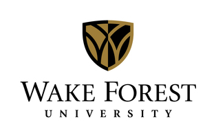

  

     
     
     
  

  <!-- container -->

  <!-- ==== ABOUT ==== -->
  

    

      

        

          

            
          

          

            <h1 id="headerName">Jose Picado</h1>
            <!--div id="headerTitle">Ph.D. Candidate in Computer Science</div-->
            <h4>jpicado [AT] gmail [DOT] com</h4>
            

              
              &nbsp;&nbsp;&nbsp;
               
              &nbsp;&nbsp;&nbsp;
              
              &nbsp;&nbsp;&nbsp;
              
            

          

        

        

          

            <!--p>I am a Ph.D. Candidate in Computer Science at Oregon State University. 
            I am a member of the <a href="http://web.engr.oregonstate.edu/~termehca/">IDEA Lab</a>.
            My research is at the intersection of data management and machine learning.

            
I have worked on software development and data science projects. You can find some of my <a href="#projects" class="smoothscroll">projects</a> and <a href="#publications" class="smoothscroll">publications</a> below.</p-->
             
            
Bio. I am a Ph.D. candidate at Oregon State University, where I do research on data management and machine learning. I have worked on software development and data science projects. See my <a href="#projects" class="smoothscroll">portfolio</a> and <a href="#publications" class="smoothscroll">publications</a> below.

            
My research has mostly focused on relational machine learning &mdash; machine learning algorithms that learn over structured data, such as relational databases. I study the impact that data heterogeneities (e.g., structural and content heterogeneities) have on the learning algorithms and how to overcome them. I am advised by <a href="http://web.engr.oregonstate.edu/~termehca/">Arash Termehchy</a>.

            
During my Ph.D., I squeezed three internships, one at Microsoft (2017) and two at Intel (2015 and 2014). I was also a teaching assistant for the Introduction to Databases, Database Management Systems, Introduction to Artificial Intelligence, Machine Learning and Data Mining, Data Structures, and Web Development courses.

            
Before that, I lived in North Carolina for two years, where I got my Masters degree in Computer Science from Wake Forest University, advised by <a href="http://utdallas.edu/~sriraam.natarajan/">Sriraam Natarajan</a>. My research was on statistical relational learning, specifically with applications to information extraction.

            
Even before that, I lived in my home country of <a href="http://happyplanetindex.org/countries/costa-rica">Costa Rica</a>, where I got my Bachelors degree in Computer Science from Costa Rica Institute of Technology and then worked as a Software Engineer at Avantica Technologies.

            
I enjoy playing tennis, football (soccer), running, music, and traveling.

            
NOTE. I am looking for a data scientist/research scientist/software engineer full-time position.

          

        

      

    

    <!-- row -->
  

  <!-- container -->

  <!-- ==== PROJECTS ==== -->
  

    

      <h2 class="centered">Portfolio</h2>
      

        

          
        

        

          
<h3>Predicting the lifespan of cloud databases</h3>

          

            
Public cloud database providers observe all sorts of different usage patterns and behaviors while operating their services. Service providers try to understand and characterize these behaviors in order to improve the quality of their service, provide new features for customers, and/or increase the efficiency of the operations. This project aimed at determining how long public cloud databases survive before being dropped. This project involved doing a large-scale survivability study of the Microsoft Azure SQL Databases, developing a machine learning classifier that classified cloud databases into short-lived and long-lived, and identifying some factors that can help predict the lifespan of cloud databases.

            <!--p>The project involved getting data from Cosmos (Microsoft's internal Big Data system) using Scope (Cosmos's query language), cleaning and wrangling the data (using SQL and pandas), performing a survivability study (using lifelines), feature engineering, developing a machine learning classifier (using scikit-learn), and visualizing the results (using matplotlib).</p-->
            Paper: <a href="papers/Survivability_SIGMOD2018.pdf">SIGMOD 2018</a> (<a href="portfolio/cloud-databases/slides_p2066-picado.pdf">slides</a>). 
            Skills: Python, pandas, scikit-learn, lifelines, matplotlib, SQL, Microsoft Cosmos (Microsoft's internal Big Data system) and Scope (Cosmos's query language). 
            Project type: Internship project (Microsoft). 
          

        

      

      <!-- project -->
      

        

          
        

        

          
<h3>Machine learning over structured data</h3>

          

            
Most machine learning algorithms assume that data can be stored in matrix form: rows represent observations and columns represent features. However, real-world data is rarely in this form. Instead, application domains usually contain information about different types of entities. One way of storing information about different types of entities is through relational databases. Given a relational database and training examples for a new concept, relational machine learning algorithms learn a definition of the concept in terms of existing relations in the database. We developed a relational learning system called Castor. We used Castor in different domains, such as learning a model to predict whether a chemical compound has anti-HIV activity, learning a model to predict whether a movie will be high grossing, and reverse-engineering SQL queries from training examples.

            Papers: <a href="papers/Castor_SIGMOD2017.pdf">SIGMOD 2017</a> (<a href="portfolio/castor/slides_Castor_SIGMOD2017.pdf">slides</a>), <a href="papers/Castor_VLDBJ2018.pdf">VLDBJ 2018</a>, <a href="papers/Castor_VLDB2016.pdf">VLDB 2016</a>. 
            Code: <a href="https://github.com/jpicado/Castor">Github</a>. 
            Skills: Java, Python, pandas, SQL, VoltDB. 
            Project type: Research project. 
          

        

      

      <!-- project -->
      

        

          
        

        

          
<h3>Machine learning over heterogeneous databases</h3>

          

            
The information in a domain is usually spread across several databases, which often represent the same entities under different names. Therefore, learning over multiple databases may result in inaccurate definitions. Currently, users have to spend a great deal of time and effort to resolve these heterogeneities and create a unified and clean database instance to be used for learning. We developed CastorX, an extension of Castor, that learns directly over heterogeneous databases without any pre-processing step. The user specifies the attributes across relations that contain values that may refer to the same real-world entity through a set of declarative constraints. CastorX leverages these dependencies to learn accurate definitions over the heterogeneous data.

            Papers: <a href="papers/p2066-picado.pdf">VLDB 2018</a>. 
            Skills: Java, Python, pandas, SQL, VoltDB. 
            Project type: Research project. 
          

        

      

      <!-- project -->
      

        

          
        

        

          
<h3>Extracting adverse drug events from text</h3>

          

            
We developed a novel approach for extracting adverse drug events from text. Given a drug-effect pair, our method searches publicly available medical literature to find documents related to the drug-effect pair. It then converts these documents to standard natural language processing (NLP) features. These features are then used in a probabilistic classifier based on Markov logic networks to determine whether the drug-effect pair is indeed an adverse drug event.

            Paper: <a href="papers/ADEKAIS.pdf">KAIS 2016</a>. 
            Skills: Java, Stanford CoreNLP. 
            Project type: Research project. 
          

        

      

      <!-- project -->
      

        

          
        

        

          
<h3>Learning to label Stack Overflow questions</h3>

          

            
We used a deep learning approach to predict the tags of Stack Overflow questions, given their title and content. In particular, we used word vectors to represent each word and, given the sequence of word vectors corresponding to a question, we used a Long Short-Term Memory (LSTM) network to predict the tags of the question.

            Report: <a href="portfolio/stackoverflow/Report.pdf">PDF</a> (<a href="portfolio/stackoverflow/Slides.pdf">slides</a>). 
            Skills: Python, keras, scikit-learn, deep learning. 
            Project type: Class project; Kaggle competition. 
          

        

      

      <!-- project -->
      

        

          
        

        

          
<h3>Using Bayesian networks to estimate rainfall distribution given polarimetric radar data</h3>

          

            
Measuring the amount of rainfall on a specific field is an important issue in agriculture. We explored the use of Bayesian networks to estimate the distribution of rainfall given measurements from Polarimetric radars. We employed two different approaches for constructing the structure of the Bayesian network. First, we manually designed the structure based on domain knowledge. Second, we applied a structure learning algorithm to learn the structure automatically from data. Results showed that the Bayes network with the structure learned from data performed best.

            Report: <a href="portfolio/rainfall/Report.pdf">PDF</a> (<a href="portfolio/rainfall/Slides.pdf">slides</a>). 
            Skills: Weka. 
            Project type: Class project; Kaggle competition. 
          

        

      

      <!-- project -->
      <!--div class="project col-md-12 vertical-align">
        

          
        

        

          
<h3>Evaluating the scalability of clustering algorithms on protein-protein interaction networks</h3>

          

            
The structure of protein-protein interaction (PPI) networks reveals important properties of the functioning of living organisms. It has been found that most clusters in a PPI network correspond to either protein complexes or functional modules. In this project, we explored the automated detection of groups of clusters in PPI networks. We employed several clustering algorithms and evaluate their scalability as a function of the size of the input networks. We analyzed PPI networks from six organisms, and report the running times of the algorithms on these networks.

            Report: <a href="portfolio/ppi/Report.pdf">PDF</a> (<a href="portfolio/ppi/Slides.pdf">slides</a>). 
            Skills: Python, igraph. 
            Project type: Class project. 
          

        

      </div-->
    

    <!-- row -->
  

  <!-- container -->

  

    
  

  <!-- container -->

  <!-- ==== PUBLICATIONS ==== -->
  

    

      <h2 class="centered">Publications</h2>
      

        <ul>
          <li>
            Logical Scalability and Efficiency of Relational Learning Algorithms 
  &nbsp;&nbsp;&nbsp;&nbsp;[<a href="papers/Castor_VLDBJ2018.pdf">PDF</a>] 
            Jose Picado, Arash Termehchy, Alan Fern, Parisa Ataei 
            The VLDB Journal (VLDBJ), 2018
          </li>
          <li>
            Learning Efficiently Over Heterogeneous Databases 
  &nbsp;&nbsp;&nbsp;&nbsp;[<a href="papers/p2066-picado.pdf">PDF</a>] 
            Jose Picado, Arash Termehchy, Sudhanshu Pathak 
            Proceedings of the VLDB Endowment (PVLDB), 2018
          </li>
          <li>
            Survivability of Cloud Databases - Factors and Prediction 
  &nbsp;&nbsp;&nbsp;&nbsp;[<a href="papers/Survivability_SIGMOD2018.pdf">PDF</a>] 
            Jose Picado, Willis Lang, Edward C. Thayer 
            Proceedings of the ACM International Conference on Management of Data (SIGMOD), 2018
          </li>
          <li>
            Learning Efficiently Over Heterogeneous Databases: Sampling and Constraints to the Rescue&nbsp;&nbsp;&nbsp;&nbsp;[<a href="papers/CastorX_DEEM2018.pdf">PDF</a>] 
            Jose Picado, Arash Termehchy, Sudhanshu Pathak 
            Proceedings of the Second Workshop on Data Management for End-to-End Machine Learning (DEEM), 2018
          </li>
          <li>
            AutoMode: Relational Learning With Less Black Magic&nbsp;&nbsp;&nbsp;&nbsp;[<a href="papers/AutoMode_ICDE18.pdf">PDF</a>] 
            Jose Picado, Sudhanshu Pathak, Arash Termehchy, Alan Fern 
            Proceedings of the IEEE International Conference on Data Engineering (ICDE), 2018
          </li>
          <li>
            Schema Independent Relational Learning&nbsp;&nbsp;&nbsp;&nbsp;[<a href="papers/Castor_SIGMOD2017.pdf">PDF</a>]&nbsp;&nbsp;&nbsp;&nbsp;[<a href="https://arxiv.org/abs/1508.03846">Technical Report</a>] 
            Jose Picado, Arash Termehchy, Alan Fern, Parisa Ataei 
            Proceedings of the ACM International Conference on Management of Data (SIGMOD), 2017
          </li>
          <li>
            Schema Independent and Scalable Relational Learning By Castor&nbsp;&nbsp;&nbsp;&nbsp;[<a href="papers/Castor_VLDB2016.pdf">PDF</a>] 
            Jose Picado, Parisa Ataei, Arash Termehchy, Alan Fern 
            Proceedings of the VLDB Endowment (PVLDB), 2016
          </li>
          <li>
            Markov Logic Networks for Adverse Drug Event Extraction from Text&nbsp;&nbsp;&nbsp;&nbsp;[<a href="papers/ADEKAIS.pdf">PDF</a>] 
            Sriraam Natarajan, Vishal Bangera, Tushar Khot, Jose Picado, Anurag Wazalwar, Vitor Santos Costa, David Page, Michael Caldwell 
            Knowledge and Information Systems Journal (KAIS), 2016
          </li>
          <li>
            Representation Independent Analytics Over Structured Data&nbsp;&nbsp;&nbsp;&nbsp;[<a href="https://arxiv.org/abs/1409.2553">Technical Report</a>] 
            Jose Picado, Yodsawalai Chodpathumwan, Arash, Termehchy, Alan Fern, Yizhou Sun 
            Technical Report, 2014
          </li>
          <!--li>
            Schema Independence of Relational Learning Algorithms&nbsp;&nbsp;&nbsp;&nbsp;[<a href="papers/SchemaIndepLearning_BUDA2014.pdf">PDF</a>] 
            Jose Picado, Arash Termehchy, Alan Fern 
            ACM SIGMOD Workshop on Big Uncertain Data (BUDA), 2014
          </li-->
          <!--li>
            Toward Representation Independent Similarity Search Over Graphs&nbsp;&nbsp;&nbsp;&nbsp;[<a href="papers/RepIndepGraphs_GRADES2014.pdf">PDF</a>] 
            Yodswalai Chodpathumwan, Arash Termehchy, Yizhou Sun, Amirhossein Aleyasin, Jose Picado 
            ACM SIGMOD Workshop on Graph Data Management Experiences and Systems (GRADES), 2014
          </li-->
          <li>
            Effectively Creating Weakly Labeled Training Examples Via Approximate Domain Knowledge&nbsp;&nbsp;&nbsp;&nbsp;[<a href="papers/WeakSupervision_ILP2014.pdf">PDF</a>] 
            Sriraam Nataranan, Jose Picado, Tushar Khot, Kristian Kersting, Christopher Re, Jude Shavlik 
            International Conference on Inductive Logic Programming (ILP), 2014
          </li>
          <li>
            Efficient Information Extraction Using Statistical Relational Learning&nbsp;&nbsp;&nbsp;&nbsp;[<a href="https://wakespace.lib.wfu.edu/handle/10339/38554">Thesis</a>] 
            Jose Picado 
            Master's Thesis, 2013
          </li>
          <li>
            Using Commonsense Knowledge to Automatically Create (Noisy) Training Examples from Text&nbsp;&nbsp;&nbsp;&nbsp;[<a href="papers/WeakSupervision_StarAI2013.pdf">PDF</a>] 
            Sriraam Natarajan, Jose Picado, Tushar Khot, Kristian Kersting, Christopher Re, Jude Shavlik 
            International Workshop on Statistical Relational AI (StarAI), 2013
          </li>
        </ul>
      
<!-- col-lg -->
    

    <!-- row -->
  

  <!-- container -->

  <!-- ==== EDUCATION ==== -->
  

    

      <h2 class="centered">Education</h2>
      

        
        <h3>Oregon State University</h3>
        Ph.D. in Computer Science 
        Machine Learning and Databases 
        Advisor: <a href="http://web.engr.oregonstate.edu/~termehca/">Arash Termehchy</a>
      
<!-- col-lg-4 -->
      

        
        <h3>Wake Forest University</h3>
        M.Sc. in Computer Science 
        Machine Learning 
        Advisor: <a href="http://utdallas.edu/~sriraam.natarajan/">Sriraam Natarajan</a>
         
        <a href="http://wakespace.lib.wfu.edu/handle/10339/38554">Thesis</a>
      
<!-- col-lg-4 --> 
      

        
        <h3>Costa Rica Institute of Technology</h3>
        B.S. in Computer Science
      
<!-- col-lg-4 --> 
    

    <!-- row -->
  

  <!-- container -->